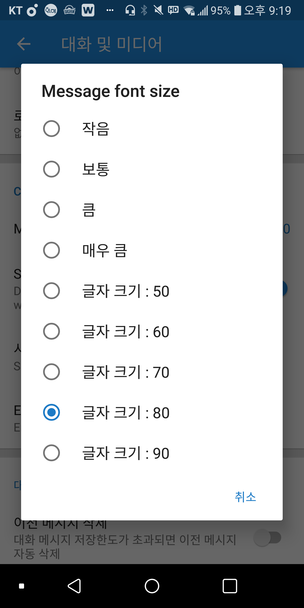
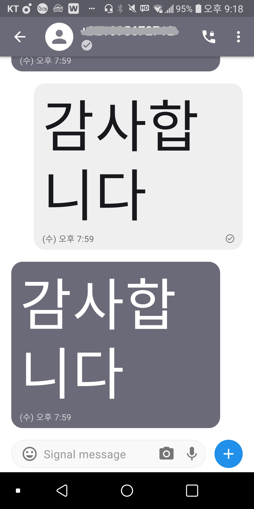
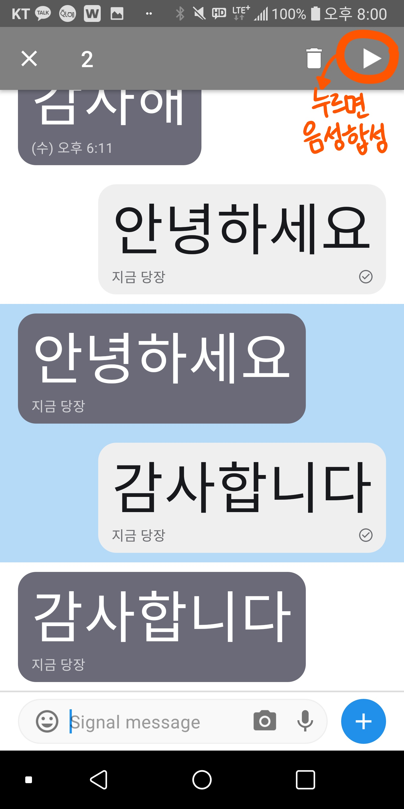

# 더 리더 The Reader
 > 더 리더는 시각장애인을 위한 메신저 어플리케이션으로 음성합성(Text-To-Speech)을 통해 사용자가 받은 메시지를 음성으로 들려주고 음성인식(Speech-To-Text)을 통해 사용자가 음성으로 말한 내용을 텍스트로 바꿔준다. 또 단순한 음성인식 기능에서 더 나아가, 음성인식된 키워드를 중심으로 관련 이모티콘을 전송하여 시각장애인들의 표현의 다양성을 높이면서 더 편리하게 메시지를 주고 받을 수 있도록 제작한 안드로이드 기반의 어플리케이션이다.

# 1. How to use

앱 설치 방법 및 사용법

APK 추출해서 다운로드 링크 걸기

# 2. 주요 기능 및 코드

2.1 UI
--

사용자의 편의에 따라 글씨 및 이모지의 크기를 세부적으로 선택할 수 있다. 예를 들어 저시력 사용자는 메시지를 크게하고, 터널시야 증상을 가진 사용자는 메시지를 작게하여 보다 편하게 메시지를 읽을 수 있을 것이다.

 

<br>

ChatsPreferenceFragment에서 글씨 크기를 선택할 수 있다. 설정된 글씨 크기는 설정 창에서도 Summary되어서 나타난다.

```javascript
public class ChatsPreferenceFragment extends ListSummaryPreferenceFragment {
    //중략
    @Override
    public void onCreate(Bundle paramBundle) {
        //중략
        findPreference(TextSecurePreferences.MESSAGE_BODY_TEXT_SIZE_PREF)
            .setOnPreferenceChangeListener(new ListSummaryListener());
       
        initializeListSummary((ListPreference)
        findPreference(TextSecurePreferences.MESSAGE_BODY_TEXT_SIZE_PREF));
        //중략
    }
    //중략
}
```

<br>


글씨 크기를 최소 13부터 최대 90까지 9개의 항목 중 선택할 수 있도록 했다.

```javascript
<string-array name="pref_message_font_size_entries">
        <!--중략-->
        <item>@string/arrays__font_50</item>
        <item>@string/arrays__font_60</item>
        <item>@string/arrays__font_70</item>
        <item>@string/arrays__font_80</item>
        <item>@string/arrays__font_90</item>
</string-array>

<string-array name="pref_message_font_size_values">
        <item>13</item>
        <item>16</item>
        <item>20</item>
        <item>30</item>
        <item>50</item>
        <item>60</item>
        <item>70</item>
        <item>80</item>
        <item>90</item>
 </string-array>
 ```
 
채팅창 상단의 글씨 크기를 확대하고 색상을 변경하였다.

 ```javascript
 <!-- 채팅창 상단의 상대방 이름 글씨 크기 확대 -->
 <org.thoughtcrime.securesms.components.emoji.EmojiTextView
         android:id="@+id/title"
         <!--중략-->
         android:textSize="30dp"
         <!--중략-->
         style="@style/TextSecure.TitleTextStyle"
         ools:ignore="UnusedAttribute"/>
 ```
 
 ```javascript
 <!--글씨 색상 변경 및 확대-->
 <TextView android:id="@+id/right_summary"
        <!--중략-->
        android:textSize="20sp"
        android:textColor="@color/white"/>
```

<br>

기존의 dark theme의 색상을 고대비로 조절하여 저시력 장애인들의 가독성을 높인다.

```javascript
<style name="TextSecure.DarkTheme" parent="@style/Theme.AppCompat">
        <item name="theme_type">dark</item>
   
      
        <item name="colorAccent">@color/white</item>
        <item name="colorControlActivated">@color/yellow</item>
        <item name="colorControlHighlight">@color/white</item>
        <!--중략-->
         
        <!--채팅창의 글자 색상 수정-->
        <item name="conversation_item_sent_text_primary_color">@color/white</item>
        <!--중략-->
        <item name="conversation_item_received_text_primary_color">@color/white</item>
        <!--중략-->
</style>
```
<br>

2.2 메세지 및 대체 텍스트를 음성합성
--

메세지를 선택 후 화면 왼쪽 상단의 재생버튼을 클릭하면 음성으로 변환한다. 여러개의 메세지를 한번에 음성합성 하는 것도 가능하며, 이모지도 대체텍스트를 이용하여 음성화한다.



<br>

ConversationActivity는 TextToSpeech.OnInitListener를 구현하는 클래스이다. TextToSpeech 객체의 생성은 onCreate()에서 이루어지며, 생성과 동시에 onInit() 메서드를 통해 한국어로 음성합성되도록 설정된다. 이 객체를 fragment 생성시에 전달하여, fragment 내에서 음성합성 기능을 이용할 수 있도록 한다. TextToSpeech 엔진은 대화창이 종료되는 onDestroy()에서 함께 종료된다.

```javascript
 public class ConversationActivity extends PassphraseRequiredActionBarActivity
                                   implements TextToSpeech.OnInitListener {
     //중략
     private ConversationFragment fragment; //메세지창 구성요소
     private TextToSpeech tts;
     
     @Override
     protected void onCreate(Bundle state, boolean ready) {
         //중략
         
         //객체 생성하고 fragment에 넘겨주기
         ConversationFragment temp=new ConversationFragment();
         tts=new TextToSpeech(this, this);  
         temp.tts=tts;
         fragment = initFragment(R.id.fragment_content, temp, dynamicLanguage.getCurrentLocale()); 
         
         //중략
     }
     
     @Override
     public void onInit(int status) { //for OninitListener 
         if (status == TextToSpeech.SUCCESS) { 
             int result = tts.setLanguage(Locale.KOREA);           //한국어로 설정
             if (result == TextToSpeech.LANG_MISSING_DATA || result == TextToSpeech.LANG_NOT_SUPPORTED) { 
                 Log.e("TTS", "This Language is not supported"); 
             } else { }
         } else {
             Log.e("TTS", "Initilization Failed!");
         }
     }
     
     @Override
     public void onDestroy() {
         //중략
         if (tts != null) {
             tts.stop();
             tts.shutdown(); //tts 엔진 중지
         }
         super.onDestroy();
     }
     
     //중략
 }
````

<br>

ConversationFragment는 대화창의 메시지 부분을 구현하는 클래스이다. 인스턴스 변수인 TextToSpeech는 ConversationActivity에서 객체를 생성할 때 넘겨받게 된다. 메시지를 선택하면 ActionMode가 되며, 왼쪽 상단의 재생 버튼을 클릭시 onActionItemClicked()를 통해 readVoiceMessage()를 호출하게 된다. readVoiceMessage()에서는 List에 선택된 메시지를 모은 후, StringBuilder를 사용하여 순차적으로 String으로 변환한다. 그리고 마지막으로 변환한 String을 tts 엔진을 이용하여 음성합성한다.

````javascript
public class ConversationFragment extends Fragment implements LoaderManager.LoaderCallbacks<Cursor>{
    //중략
    public TextToSpeech tts; //ConversationActivity로 부터 넘겨받게 된다.
    
    private void readVoiceMessage(final Set<MessageRecord> messageRecords) {
    
        //List에 선택된 메시지를 모으기(다중 선택도 가능)
        List<MessageRecord> messageList = new LinkedList<>(messageRecords);
        Collections.sort(messageList, new Comparator<MessageRecord>() {
            @Override
            public int compare(MessageRecord lhs, MessageRecord rhs) {
                if      (lhs.getDateReceived() < rhs.getDateReceived())  return -1;
                else if (lhs.getDateReceived() == rhs.getDateReceived()) return 0;
                else                                                     return 1;
            }
        }); 

        StringBuilder bodyBuilder = new StringBuilder();

        //선택된 모든 메시지의 내용을 StringBuilder로 build
        for (MessageRecord messageRecord : messageList) {
            String body = messageRecord.getDisplayBody().toString();
            if (!TextUtils.isEmpty(body)) {
                bodyBuilder.append(body).append('\n');
            } /
        }

        //StringBuilder에 저장한 내용을 String으로 변환하고, tts 엔진을 이용하여 음성합성
        String result = bodyBuilder.toString();

        if (!TextUtils.isEmpty(result))
           tts.speak(result,TextToSpeech.QUEUE_FLUSH,null);
   }
   
   @Override
   public boolean onActionItemClicked(ActionMode mode, MenuItem item) {
       switch(item.getItemId()) {
           case R.id.menu_context_voice: //보이스(재생) 버튼
               readVoiceMessage(getListAdapter().getSelectedItems()); //클릭되면 음성합성 메서드 호출
               actionMode.finish(); //실행 후 액션모드 종료
               return true;
           //중략
       }
   }
   
   //중략
}
````
  
2.3 음성인식
--
ConversationAcitvity는 RecognitionListener객체를 포함하며 액티비티 생성시에 Speechintent객체와 RecognitionListener객체를 준비시킨다.
````javascript
public class ConversationActivity extends PassphraseRequiredActionBarActivity(){
 //중략
 private Intent Speechintent; //음성인식 Intent
 SpeechRecognizer mRecognizer; 
 HashMap<String,String[]> randomEmojiData;
  
 protected void onCreate(Bundle state, boolean ready) {
  //중략
  Speechintent = new Intent(RecognizerIntent.ACTION_RECOGNIZE_SPEECH);
  Speechintent.putExtra(RecognizerIntent.EXTRA_CALLING_PACKAGE, getPackageName());
  Speechintent.putExtra(RecognizerIntent.EXTRA_LANGUAGE, "ko-KR");
  mRecognizer = SpeechRecognizer.createSpeechRecognizer(this);
  mRecognizer.setRecognitionListener(recognitionListener);
 }
````
음성을 인식하고 String으로 전환하는 RecognitionListener객체는 음성인식 완료 후 인식된 결과를 ArrayList의 형태로 변환한후 다시한번 String array형태로 변환한다. 인식된 음성 중 가장 첫번째 단어를 키워드로 간주해 randomEmojiSend에 전달하여 이모티콘을 전송한다.
````javascript
private RecognitionListener recognitionListener = new RecognitionListener() {
    @Override
    public void onResults(Bundle bundle) { //음성인식 완료 후 실행되는 메소드
      Log.i(TAG, "음성인식 결과");
      String key = "";
      key = SpeechRecognizer.RESULTS_RECOGNITION; //인식된 키워드를 불러온다.
      ArrayList<String> mResult = bundle.getStringArrayList(key); //키워드를

      String[] rs = new String[mResult.size()];
      mResult.toArray(rs);

      randomEmojiSend(rs[0]); //첫번째 단어를 이용해 이모티콘을 전송한다.
    }
    //중략
};
````

2.4 키워드 분류 및 이모티콘 전송
--
````javascript
@Override
  public boolean onEmojiVoice(){ //이모지 버튼 길게 눌러졌을 때 음성인식 실행
    mRecognizer.startListening(Speechintent);
    return true;
    //return false; //이 메서드에서 이벤트에 대한 처리를 끝내지 못하므로
  }

  public void makeEmojiData(){
    randomEmojiData= new HashMap<String,String[]>();
    randomEmojiData.put("웃음",new String[]{"😊","😁","😄","😀"});
    randomEmojiData.put("사랑",new String[]{"😍","😘","❤","💖","💕"});
    randomEmojiData.put("기뻐",new String[]{"😊","😁","😄"});
    randomEmojiData.put("슬픔",new String[]{"☹","😫","😔","😿","😭","😥"});
    randomEmojiData.put("축하",new String[]{"🎉","🎊","👏"});
    randomEmojiData.put("미안",new String[]{"😭","😥"});
    randomEmojiData.put("안녕",new String[]{"👋","🙋","✋"});
    randomEmojiData.put("최고",new String[]{"👍","👏"});
    randomEmojiData.put("기쁨",new String[]{"🤩","🤗","😽","😆","😃"});
    randomEmojiData.put("멘붕",new String[]{"😱","🤯","😵"});
    randomEmojiData.put("화남",new String[]{"😡","🤬","😤","😠"});
    randomEmojiData.put("아픔",new String[]{"😷","🤧","🤒","🤕"});
    randomEmojiData.put("하트",new String[]{"❤","🧡","💛","💚","💙","💜","❣","💓","💗"});
  }
  public void randomEmojiSend(String result){
    if(!randomEmojiData.containsKey(result)) {

      Toast.makeText(this,"키워드가 데이터베이스에 존재하지 않음",Toast.LENGTH_SHORT).show();
      return;
    }
    composeText.insertEmoji(randomEmojiData.get(result)[(int)(Math.random()*randomEmojiData.get(result).length)]);
    sendMessage();
  }
````

# 3. 사용한 API
Signal-android            https://github.com/signalapp/Signal-Android

Android Text-to-Speech    https://developer.android.com/reference/android/speech/tts/TextToSpeech     


# 4. 개발자 정보
1515003 고영지(youngji-koh) - 사용자 인터페이스 및 음성합성 기능 구현
- Youngji : 글씨 크기 조절 기능 추가, 고대비 테마 추가, 음성합성 기능 구현 담당

1615035 신유진(jellyb3ar) - 음성인식 및 키워드 분류 기능 구현
- jellyb3ar : 음성인식 및 키워드에 따른 이모티콘 전송 기능 구현 담당

1771018 김혜지(kimhj5854) - 음성인식 및 키워드 분류 기능 구현
- Maeg : 음성인식 및 키워드에 따른 이모티콘 전송 기능 구현, 

1771045 이지은(Iamjieun) - 음성인식 및 키워드 분류 기능 구현 
- Iamjieun : 음성인식 및 키워드에 따른 이모티콘 전송 기능 구현, 이모티콘 데이터베이스

1771104 조예원(QueenCurry) - 음성합성 기능 및 사용자 인터페이스 구현, 음성인식 이모티콘 자동 전송 기능 구현
- JoYewon : 카카오 앱 키 설정, 음성합성 기능 구현, 글씨 크기 조절 기능 일부 추가
- QueenCurry-README : Readme.md에 음성합성 기능 설명 및 스크린샷 추가, UI 스크린샷 추가, 기타 요소 추가
- JoYewon-Emoji : 키워드 음성 인식으로 이모티콘을 자동 전송하는 기능 구현.


# License

Copyright 2011 Whisper Systems

Copyright 2013-2017 Open Whisper Systems

Licensed under the GPLv3: http://www.gnu.org/licenses/gpl-3.0.html

Google Play and the Google Play logo are trademarks of Google Inc.
